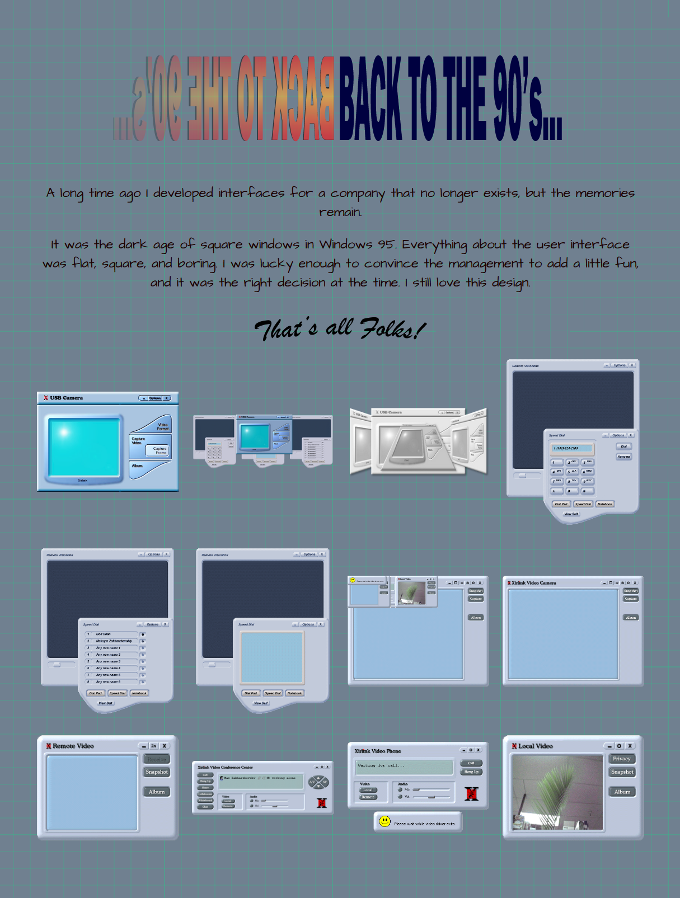

# "Back to the 90's..." project

A long time ago I developed interfaces for a company that no longer exists, but the memories remain.

It was the dark age of square windows in Windows 95. Everything about the user interface was flat, square, and boring. I was lucky enough to convince the management to add a little fun, and it was the right decision at the time. I still love this design.

The original website is still available through [theoldnet.com](https://theoldnet.com/get?decode=false&scripts=false&year=1997&url=http://xirlink.com/vp.htm).

